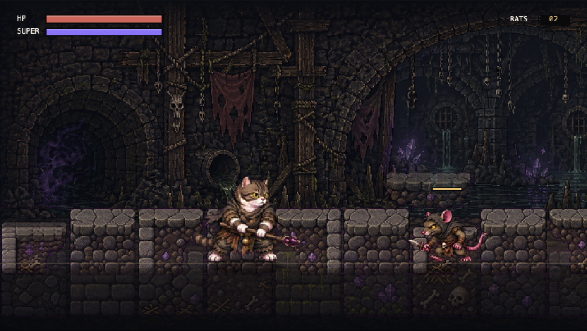
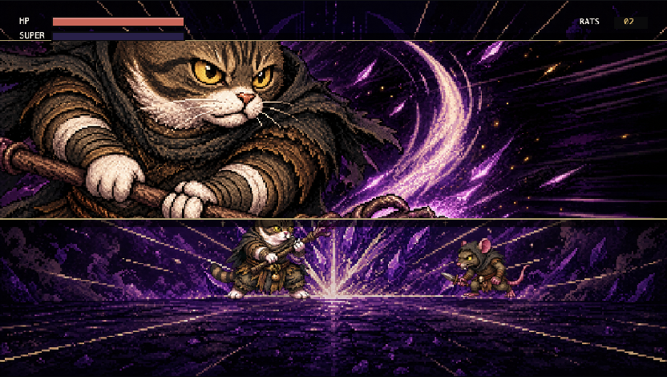
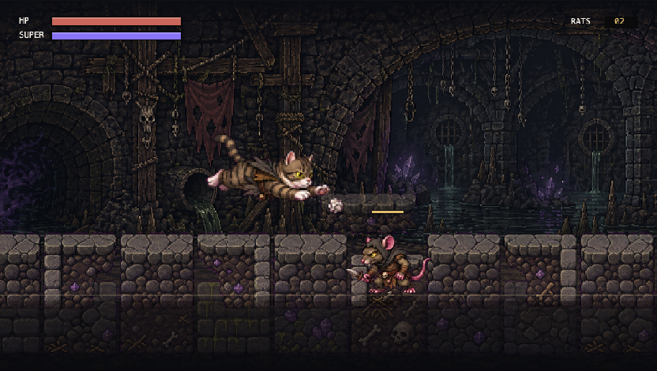

# Kitty Brawl

Kitty Brawl is a first playable browser prototype for a 1990s-style side-scrolling action game: a robed warrior cat fights cave rats, builds super meter, and faces a rat boss with dramatic cut-in attacks.

The project is currently a lightweight static web demo built around an HTML canvas, pixel-art sprite sheets, and data-driven animation configuration.



## Current Prototype

- Playable cat hero with idle, run, jump, melee attack, hurt, death, super activation, and super attack states.
- Rat enemies with walk, attack, hurt, and death animations.
- Rat boss encounter with boss health, rush-in entrance, food hypnosis attack, paper-ball pounce trap, kick follow-up, and random jump repositioning near the player.
- Cat-form status animations used by the boss attacks.
- Long scrolling level with camera follow, tilemap data, processed tiles, and a dark fantasy rat-den background.
- Player super move presentation with a screen-wide cut-in and special background plate.
- Project-local Codex skills for repeating the character, level, sprite-action, and style workflows.

## Screenshots

| Gameplay | Super Cut-in | Cat Form |
| --- | --- | --- |
|  |  |  |

## Controls

| Action | Keys |
| --- | --- |
| Move | `A` / `D` or `Left` / `Right` |
| Jump | `W`, `Up`, or `Space` |
| Attack | `J` |
| Super | `K` |
| Reset encounter | `R` |
| Debug cat-form states | `0` through `7` |

## Run Locally

This prototype does not need a build step. Serve the repo root with any static file server:

```bash
python3 -m http.server 4173
```

Then open:

```text
http://localhost:4173/
```

## Project Layout

```text
.
|-- index.html
|-- styles.css
|-- src/
|   `-- main.js
|-- assets/
|   |-- characters/
|   |-- data/
|   |-- effects/
|   `-- levels/
|-- docs/
|   `-- screenshots/
|-- .codex/
|   `-- skills/
|-- SPEC.md
|-- FIRST_PLAYABLE_SPEC.md
|-- SCROLLING_CAMERA_SPEC.md
`-- RAT_BOSS_SPEC.md
```

## Asset Pipeline Notes

Most sprite assets are stored as generated sheets with transparent backgrounds, extracted frame PNGs, preview sheets, GIF previews, and pipeline metadata. The main animation definitions live in:

```text
assets/data/player-animations.json
```

The current level map is data-driven:

```text
assets/data/levels/rat-den-01.json
```

Project-local skills live in `.codex/skills/` and are intended to reduce repeated context when creating new characters, enemies, actions, effects, and levels.

## Design Direction

- 16-bit retro pixel art inspired by SNES / Sega Genesis action platformers.
- Dark fantasy rat-den environment with readable silhouettes and high-contrast sprite outlines.
- Combat presentation inspired by arcade fighters, especially cut-in timing for super moves and boss specials.

## Roadmap

- Add proper collision tiles and platform behavior instead of purely visual tilemap drawing.
- Expand boss AI with more readable telegraphs and safer dodge windows.
- Add audio for attacks, impacts, boss specials, and UI feedback.
- Add pickups, checkpoints, pause menu, and stage clear flow.
- Continue converting asset generation workflows into reusable project skills.
